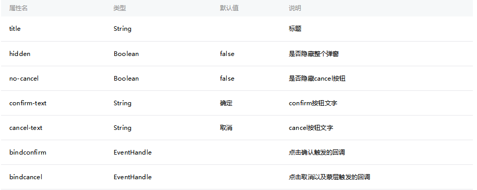
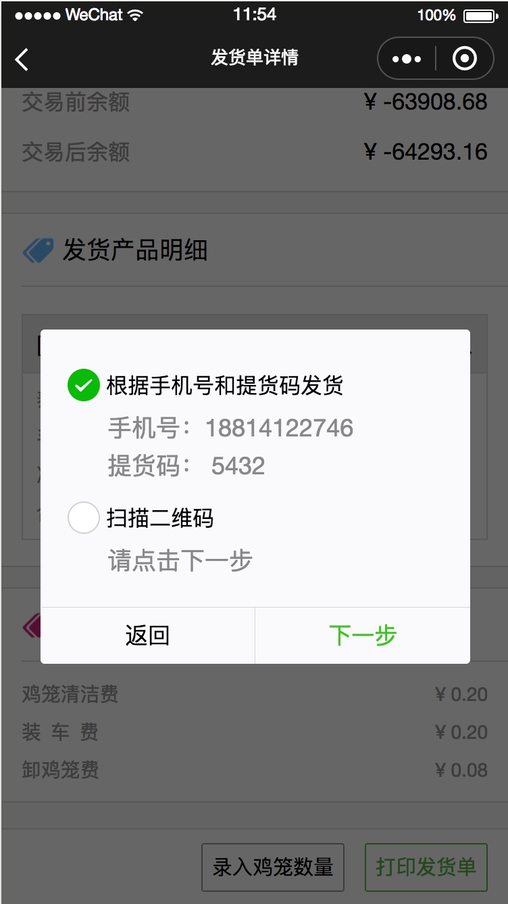

> 在小程序 [官方文档](https://developers.weixin.qq.com/miniprogram/dev/) 中可以使用 [wx.showModal()](https://developers.weixin.qq.com/miniprogram/dev/api/api-react.html#wxshowmodalobject) 方法来生成 Modal 蒙层弹框，但是其显示的内容只能为文本格式且由传入参数限定，显示方式比较单一，不能满足日常多样化的需求。本人查阅了相关资料完成一些自定义Modal组件，可以满足个性化需求。转载请说明出处。

<!--more-->

## 实现思路
在这里的实现思路主要是通过微信小程序的原生 Modal 组件来实现，这个组件在最新版的官方文档中已经找不到，估计官方是想用 `wx.showModal()` 方法来代替使用，但是仍然可以向下兼容使用。通过原生的 Modal 组件我们可以自定义自己的内容界面，Modal 组件的 api 文档如下



再对比 `wx.showModal()` 的 api 文档不难看出其只是对 Modal 组件的进一步封装。

## 源码

### wxml
```
......

<!--打印发货单蒙层-->
  <modal hidden="{{hideModal}}" class='modal' cancel-text='返回' confirm-text='下一步' bindcancel="cancelPrint" bindconfirm="confirmPrint" catchtouchmove='preventTouchMove'>
    <view class='modal-box'>
      <radio-group bindchange='radioChange'>
        <label class='radio modal-item'>
          <view class='modal-item-hd'>
            <radio value='1' checked='{{radioIndex == 1}}'></radio>
            <view>根据手机号和提货码发货</view>
          </view>
          <view class='modal-item-bd'>
            <view>手机号：{{phone}}</view>
            <view>提货码：{{detail.ladingCode}}</view>
          </view>
        </label>
        <label class='radio modal-item'>
          <view class='modal-item-hd'>
            <radio value='2'></radio>
            <view>扫描二维码</view>
          </view>
          <view class='modal-item-bd'>
            <view>请点击下一步</view>
          </view>
        </label>
      </radio-group>
    </view>
  </modal>
......
```
wxml文件最关键部分是 `<modal></modal>` 组件的调用，参数解析如下

* 通过 `hidden` 属性来控制蒙层的显示和隐藏
* `bindcancel` 属性绑定返回时间
* `bindconfirm` 属性绑定确认事件
* `catchtouchmove` 防止触摸滑动穿透，即当 modal 弹层下的页面有滚动条，在 modal 弹层上触摸滑动时下面的页面仍跟着滚动的情况。

### js
```
  data: {
    phone: null,
    detail: null,
    hideModal: true,
    radioIndex: 1
  },
  
  ......
  
  /**
   * 显示modal组件
   */
  printDel: function() {
    this.setData({
      hideModal: false
    })
  },
  
  /**
   * 隐藏modal组件
   */
  cancelPrint: function() {
    this.setData({
      hideModal: true
    })
  },
  
  /**
   * 阻断蒙层事件向下传递
   */
  preventTouchMove: function() {
  }

  /**
   * 选择打印发货单方式
   */
  radioChange: function(e) {
    this.setData({
      radioIndex: e.detail.value
    })
  },
  
  /**
   * 确认打印
   */
  confirmPrint: function() {
    var radioIndex = this.data.radioIndex
    if(radioIndex == 1) {
      //根据手机号和提货码发货
      wx.showToast({
        title: '请在终端屏幕上输入手机号和提货码',
        icon: 'none'
      })
    }else {
      //扫描二维码
      /** code */
      this.setData({
        hideModal: true
      })
    }
  },
  
  ....
```
js 文件中最关键的是 `this.setData({ hideModal: true / false })` 来控制 Modal 组件的隐藏/显示，以及空方法 `preventTouchMove()` 阻止事件向父节点传递。

> 以bind或catch开头，然后跟上事件的类型，bind事件绑定不会阻止冒泡事件向上冒泡，catch事件绑定可以阻止冒泡事件向上冒泡。

详见 [小程序事件](https://developers.weixin.qq.com/miniprogram/dev/framework/view/wxml/event.html)

### wxss
```
......

.modal-item-hd {
  display: flex;
  align-items: center
}

.modal-item-hd view {
  font-size: 32rpx;
  color: #000;
  padding-top: 5rpx
}

.modal-item-bd {
  margin: 10rpx 0 20rpx 60rpx;
  font-size: 36rpx;
}

......
```
wxss比较简单，在这里不做详细解析。

## 最终效果
<div style="width: 50%"><div>

## 参考文档
[自定义模态对话框实例](https://blog.csdn.net/zhuyb829/article/details/73349295)  
[微信小程序之----弹框组件modal](https://www.cnblogs.com/liululin/p/6001437.html)  
[小程序 实现遮罩层](https://blog.csdn.net/u011072139/article/details/54016575)